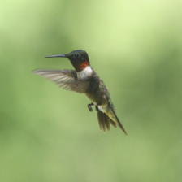

# Utils

## Salient map generator
You can use this script to generate salient maps for NAT models, as seen in 
[Neighborhood Attention Transformer (NAT)](https://arxiv.org/abs/2204.07143).

Simply specify an input image, output path, and model name to get started:

```
python utils/gen_salient_maps.py  --image eagle.png --image-out eagle_salient.png --model nat_base --use-cuda
```

We highly recommend using CUDA, as the default number of rounds is `100`.
If you're not using CUDA, you can try fewer rounds:

```
python utils/gen_salient_maps.py  --image eagle.png --image-out eagle_salient.png --model nat_base --rounds 10
```

# Salient maps

| Original | ViT-Base | Swin-Base | NAT-Base |
|---|---|---|---|
|  |   |  |  |
|  |   |  |  |
|  |   |  |  |
|  |   |  |  |

